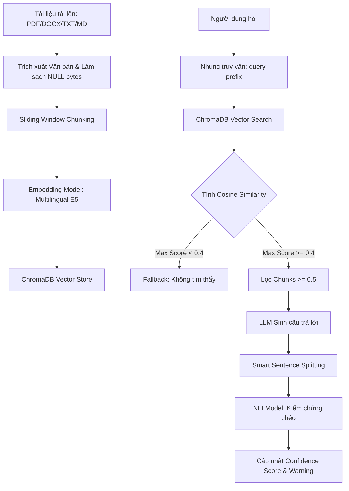

# BÁO CÁO PHÂN TÍCH THUẬT TOÁN HỆ THỐNG
## RAG - SMART DOCUMENT READER

Tài liệu này cung cấp một bản phân tích chuyên sâu về mặt Toán học và Tin học máy tính đối với tất cả các thuật toán xử lý dữ liệu, mô hình hóa kiến thức, truy xuất thông tin (RAG), và tích hợp AI trong dự án **RAG - Smart Document Reader**.

---

## 1. Tổng quan Kiến trúc Dữ liệu & Luồng Thuật toán

Hệ thống được thiết kế theo mô hình client-server phân tầng với ba thành phần cốt lõi xử lý dữ liệu:
1. **Relational Database (SQLite + SQLAlchemy)**: Lưu trữ metadata tài liệu, lịch sử hội thoại, nhật ký làm bài trắc nghiệm (`quiz_history`) và trạng thái học tập của người dùng (`user_knowledge`).
2. **Vector Database (ChromaDB + Sentence Transformers)**: Lưu trữ biểu diễn không gian vector (embeddings) của các phân đoạn tài liệu phục vụ tìm kiếm ngữ nghĩa (Semantic Search).
3. **AI Models Core**:
   - **Embedding Model**: `SentenceTransformer` cục bộ phục vụ trích xuất vector ngữ nghĩa.
   - **NLI Model**: HuggingFace Pipeline phân loại kiểm chứng chéo (Natural Language Inference) để phát hiện ảo giác (hallucination).
   - **LLM Engine**: Local LLM (LM Studio / Ollama) hoặc GPT thông qua giao tiếp API.



---

## 2. Tiền xử lý & Cắt nhỏ Văn bản (Document Processing & Chunking)

Được định nghĩa trong [document_service.py](file:///c:/Users/Admin/Documents/GitHub/RAG/rag_project/backend/services/document_service.py).

### 2.1. Trích xuất & Làm sạch dữ liệu (Sanitization)
* **Trích xuất**: 
  - File PDF được phân tích bằng thư viện **PyMuPDF** (`fitz`), đọc tuần tự qua từng trang.
  - File DOCX được xử lý qua **python-docx**, đọc các đoạn (`paragraphs`) và ước lượng số trang bằng công thức: $\text{Page Estimate} = \max(1, \text{Word Count} \div 300)$.
  - File TXT/MD được đọc trực tiếp bằng mã hóa UTF-8 hoặc Latin-1.
* **Loại bỏ ký tự Null (Null-byte Sanitization)**: 
  Để tránh lỗi crash database SQLite và lỗi phân tích cú pháp trong bộ sinh index của ChromaDB (`A string literal cannot contain NUL`), toàn bộ ký tự Null (`\x00` và `\u0000`) đều được lọc bỏ triệt để:
  ```python
  text = text.replace('\x00', '')
  text = text.replace('\u0000', '')
  ```

### 2.2. Phân tách văn bản cửa sổ trượt (Sliding Window Chunking)
Bộ chunking sử dụng thuật toán cửa sổ trượt (Sliding Window) dựa trên số từ (words) thay vì số ký tự để đảm bảo tính trọn vẹn ngữ nghĩa của từ vựng tiếng Việt:
* **CHUNK_SIZE** = $600$ từ.
* **CHUNK_OVERLAP** = $80$ từ.
* **Bước nhảy (Step size)**: 
  $$\text{Step} = \text{CHUNK\_SIZE} - \text{CHUNK\_OVERLAP} = 520 \text{ từ}$$

**Mô tả thuật toán**:
Văn bản được tách thành mảng các từ bởi khoảng trắng. Với mỗi vòng lặp, hệ thống lấy ra một cửa sổ gồm $600$ từ liên tiếp, sau đó dịch chuyển cửa sổ đi $520$ từ cho phân đoạn tiếp theo. Việc giữ lại $80$ từ trùng lặp giúp bảo toàn ngữ cảnh chuyển tiếp giữa các phân đoạn kề nhau.

---

## 3. Nhúng Vector & Truy vết Ngữ nghĩa (Vector Embedding & Retrieval)

Được định nghĩa trong [llm_service.py](file:///c:/Users/Admin/Documents/GitHub/RAG/rag_project/backend/services/llm_service.py).

### 3.1. Mô hình hóa Vector & Cú pháp đặc thù E5 (Prefix Strategy)
Hệ thống sử dụng mô hình nhúng **Multilingual E5** (ví dụ: `intfloat/multilingual-e5-small` hoặc các phiên bản tương tự). Nhóm mô hình E5 yêu cầu áp dụng tiền tố đặc trưng để tối ưu hóa nhiệm vụ so khớp ngữ nghĩa:
* **Khi index tài liệu (Indexing)**: Mỗi đoạn văn bản (passage) được chèn thêm tiền tố `"passage: "` trước khi chạy mô hình để định rõ vai trò là tài liệu nguồn.
  $$\vec{e}_{\text{passage}} = \text{Embed}(\text{"passage: "} + \text{Text})$$
* **Khi tìm kiếm (Retrieval)**: Câu hỏi truy vấn được chèn thêm tiền tố `"query: "` để định rõ vai trò là câu hỏi cần tìm thông tin.
  $$\vec{e}_{\text{query}} = \text{Embed}(\text{"query: "} + \text{Query})$$

### 3.2. Không gian Khoảng cách & Cosine Similarity
ChromaDB được cấu hình hoạt động trên không gian vector với độ đo khoảng cách là **Cosine Distance**:
$$\text{Cosine Distance}(u, v) = 1 - \frac{u \cdot v}{\|u\|_2 \|v\|_2}$$

Vì khoảng cách trả về từ ChromaDB là Cosine Distance ($d \in [0, 2]$), hệ thống sẽ biến đổi ngược lại thành điểm tương đồng **Cosine Similarity** ($s \in [0, 1]$) thông qua công thức:
$$s = \max\left(0.0, 1.0 - d\right)$$
Công thức toán học đầy đủ để tính độ tương đồng giữa vector truy vấn $\vec{q}$ và vector tài liệu $\vec{p}$ trong code Python là:
$$\text{Sim}(\vec{q}, \vec{p}) = \frac{\sum_{i=1}^d q_i p_i}{\sqrt{\sum_{i=1}^d q_i^2} \sqrt{\sum_{i=1}^d p_i^2}}$$

### 3.3. Thread-safe Search Query Caching (Bộ nhớ đệm Truy vấn)
Để giảm thiểu chi phí tính toán nhúng vector và tìm kiếm láng giềng gần nhất (ANN) trên ChromaDB, hệ thống cài đặt một bộ nhớ đệm `_search_cache` đi kèm cơ chế khóa luồng `threading.Lock()` để đảm bảo an toàn đa luồng (thread-safety):
* **Cơ chế khóa key**: Tạo mã băm MD5 từ truy vấn, số lượng kết quả và danh sách tài liệu được chọn:
  $$\text{Key} = \text{MD5}(\text{Query} + \text{top\_k} + \text{Sorted(Allowed Files)})$$
* **Chính sách thu hồi (Eviction Policy)**: 
  - Giới hạn kích thước cache tối đa: $256$ mục (sử dụng xấp xỉ FIFO để giải phóng bộ nhớ khi đầy).
  - Giới hạn thời gian sống (TTL): $3600$ giây (1 giờ).
  - Bộ nhớ đệm tự động bị xóa toàn bộ (`invalidate`) ngay khi có bất kỳ tài liệu mới nào được nạp vào ChromaDB để tránh kết quả lỗi thời.

---

## 4. Hỏi & Đáp Thông minh Thích ứng (Adaptive Context & Dual-Threshold Q&A)

Được định nghĩa trong [rag_service.py](file:///c:/Users/Admin/Documents/GitHub/RAG/rag_project/backend/services/rag_service.py).

### 4.1. Cơ chế Tự động Chọn Chế độ (Context-aware Mode Selection)
Hệ thống giải quyết triệt để vấn đề mất mát ngữ cảnh của RAG bằng cách áp dụng cơ chế tự động chuyển đổi chế độ dựa trên độ dài tài liệu:
* **Full-Context Mode**: Nếu tổng độ dài văn bản của các tài liệu được chọn nhỏ hơn hoặc bằng giới hạn an toàn của LLM (thông số `FULL_CONTEXT_THRESHOLD_CHARS` hoặc giới hạn context window của mô hình sau khi trừ overhead), hệ thống sẽ nạp 100% nội dung vào prompt. Độ chính xác đạt $100\%$, điểm tin cậy mặc định bằng $1.0$.
* **RAG Mode**: Nếu tài liệu vượt quá ngưỡng, hệ thống tự động kích hoạt truy xuất phân đoạn ngữ nghĩa từ ChromaDB dựa trên tham số `top_k`.

### 4.2. Chiến lược Ngưỡng kép (Dual-Threshold Fallback Strategy)
Để ngăn chặn AI bịa đặt thông tin (hallucination) khi tài liệu không chứa câu trả lời, hệ thống cài đặt cơ chế kiểm soát ngưỡng tương đồng kép:
* **Ngưỡng phủ quyết (NO_CONTEXT_THRESHOLD = 0.4)**:
  Nếu tất cả các đoạn tài liệu tìm được đều có điểm tương đồng Cosine Similarity nhỏ hơn $0.4$, hệ thống từ chối gọi LLM và trả về câu trả lời mặc định: *"Không tìm thấy thông tin liên quan trong tài liệu."* Điều này giúp tiết kiệm tài nguyên tính toán và chặn đứng ảo giác từ sớm.
* **Ngưỡng lọc nội dung (RELEVANCE_THRESHOLD = 0.5)**:
  Nếu có chunks vượt qua ngưỡng phủ quyết, hệ thống sẽ lọc lại và chỉ giữ những chunks có điểm tương đồng $\ge 0.5$ làm ngữ cảnh đưa vào prompt cho LLM.
* **Fallback an toàn**: Nếu có chunks $\ge 0.4$ nhưng không có chunk nào $\ge 0.5$ (tất cả đều nằm ở khoảng giữa), hệ thống sẽ sử dụng toàn bộ chunks tìm được làm context thay vì gửi context rỗng.

### 4.3. Công thức tính Điểm Tin cậy (Confidence Score)
Điểm tin cậy của câu trả lời được tính toán dựa trên trung bình có trọng số (weighted average) điểm tương đồng của các đoạn văn bản được chọn làm ngữ cảnh:
$$\text{Confidence Score} = \frac{\sum_{i=1}^M s_i^2}{\sum_{i=1}^M s_i}$$
Trong đó $s_i$ là độ tương đồng Cosine Similarity của chunk thứ $i$. Việc bình phương $s_i$ trong trọng số giúp các đoạn có độ tương đồng rất cao đóng góp nhiều hơn vào độ tin cậy chung của câu trả lời.

---

## 5. Tách câu Thông minh & Phân tích Áo giác bằng NLI (Claim Verification)

### 5.1. Thuật toán Tách câu Thông minh (Smart Sentence Splitting)
Được định nghĩa trong hàm `split_into_sentences` của [rag_service.py](file:///c:/Users/Admin/Documents/GitHub/RAG/rag_project/backend/services/rag_service.py).
Nếu chỉ sử dụng các dấu ngắt câu `.`, `?`, `!` thông thường, văn bản tiếng Việt sẽ bị ngắt sai tại các vị trí chứa số thập phân hoặc chữ viết tắt học thuật/chức danh. Hệ thống cài đặt bộ chia câu dựa trên Regular Expressions với cơ chế bảo vệ $4$ bước:
1. **Bảo vệ số thập phân**: Chuyển các dấu chấm nằm giữa hai chữ số (e.g., $3.14$, $1.5$) thành ký tự tạm: `\1_DECIMAL_DOT_\2`.
2. **Bảo vệ tên riêng viết tắt**: Các chữ cái viết tắt tên riêng đơn lẻ (e.g., *N.V. An*) được chuyển thành `\1_ABBR_DOT_`.
3. **Bảo vệ từ viết tắt học thuật / danh xưng**: Duyệt qua danh sách từ viết tắt phổ biến:
   $$\mathcal{A} = \{\text{"gs", "ts", "pgs", "ths", "tp", "dr", "mr", "mrs", "ms", "vs", "vol", "no", "prof", "tphcm", "co"}\}$$
   Nếu gặp dạng `[Abbr].` thì chuyển thành `[Abbr]_ABBR_DOT_`.
4. **Chia câu & Khôi phục**: Thực hiện chia câu theo Regex `(?<=[.?!])\s+` và khôi phục các dấu chấm đã bảo vệ bằng cách thay thế ngược lại `_DECIMAL_DOT_` và `_ABBR_DOT_` thành dấu `.`.

### 5.2. Thuật toán Đối chứng Logic chéo (NLI Verification)
Hệ thống sử dụng mô hình lập luận tự nhiên **NLI (Natural Language Inference)** để phát hiện ảo giác bằng cách đối chiếu từng tuyên bố (claim) trong câu trả lời của AI với ngữ cảnh gốc (premise):
1. Chia câu trả lời của AI thành danh sách các câu đơn (claims) thông qua bộ tách câu thông minh bên trên.
2. Với mỗi claim $c_j$ và toàn bộ ngữ cảnh $P$, mô hình NLI sẽ xuất ra phân phối xác suất trên 3 lớp: $\text{entailment}$ (kéo theo/đúng), $\text{neutral}$ (trung lập), và $\text{contradiction}$ (mâu thuẫn).
   $$\text{NLI}(P, c_j) = [p_{\text{entailment}}, p_{\text{neutral}}, p_{\text{contradiction}}]$$
3. **Cơ chế Phạt điểm Tin cậy (Penalization Mechanism)**:
   Hệ thống lấy nhãn có xác suất cao nhất (argmax). Điểm tin cậy chung sẽ bị khấu trừ dựa trên nhãn dự đoán:
   - Nếu nhãn là `contradiction` (mâu thuẫn trực tiếp với tài liệu):
     $$\text{Confidence Score} \leftarrow \max\left(0.0, \text{Confidence Score} - 0.2\right)$$
     Đồng thời kích hoạt nhãn cảnh báo ảo giác (`warning`) cho người dùng.
   - Nếu nhãn là `neutral` (thông tin không có trong ngữ cảnh nhưng chưa chắc sai):
     $$\text{Confidence Score} \leftarrow \max\left(0.0, \text{Confidence Score} - 0.1\right)$$
   - Nếu nhãn là `entailment` (khớp hoàn toàn ngữ cảnh): Giữ nguyên điểm.

---

## 6. Mô hình hóa Kiến thức Bayesian (Bayesian Knowledge Tracing - BKT)

Được định nghĩa trong [adaptive_tutor_service.py](file:///c:/Users/Admin/Documents/GitHub/RAG/rag_project/backend/services/adaptive_tutor_service.py).

### 6.1. Định nghĩa Không gian Trạng thái BKT
BKT là một mô hình Markov ẩn (Hidden Markov Model - HMM) mô hình hóa việc nắm vững kiến thức của người học qua các tương tác làm bài trắc nghiệm. Trạng thái thực sự của người học đối với mỗi phân đoạn kiến thức (chunk $k$) là một biến nhị phân ẩn $L_k \in \{0, 1\}$ (0: chưa hiểu bài, 1: đã hiểu bài).

Các tham số chuẩn được thiết lập trong hệ thống:
* $P(L_0) = 0.5$ (Xác suất hiểu bài ban đầu - prior).
* $p_{slip} = 0.1$ (Xác suất học sinh hiểu bài nhưng làm sai do bất cẩn).
* $p_{guess} = 0.2$ (Xác suất học sinh chưa hiểu bài nhưng làm đúng do đoán mò).
* $p_{transit} = 0.1$ (Xác suất học sinh học được kiến thức mới sau khi luyện tập qua câu hỏi).

### 6.2. Thuật toán Cập nhật Trạng thái (Update Equations)
Khi người học thực hiện một câu hỏi liên quan đến chunk $k$ với kết quả trả lời $C_k \in \{0, 1\}$ (0: sai, 1: đúng), hệ thống tính toán xác suất cập nhật như sau:

#### Bước 1: Tính xác suất hậu nghiệm (Posterior Probability) dựa trên quan sát câu trả lời
* **Trường hợp người học trả lời ĐÚNG ($C_k = 1$)**:
  Xác suất thực sự hiểu bài của người học là:
  $$P(L_k | C_k = 1) = \frac{P(L_k) \cdot (1 - p_{slip})}{P(L_k) \cdot (1 - p_{slip}) + (1 - P(L_k)) \cdot p_{guess}}$$

* **Trường hợp người học trả lời SAI ($C_k = 0$)**:
  Xác suất học sinh thực chất vẫn hiểu bài nhưng bị làm sai (do slip) là:
  $$P(L_k | C_k = 0) = \frac{P(L_k) \cdot p_{slip}}{P(L_k) \cdot p_{slip} + (1 - P(L_k)) \cdot (1 - p_{guess})}$$

#### Bước 2: Cập nhật xác suất hiểu bài sau cơ hội học tập (Transition)
Sau khi hoàn thành câu hỏi, giả định người học có cơ hội tích lũy thêm kiến thức mới (được xem giải thích đáp án). Xác suất hiểu bài cập nhật cho tương lai là:
$$P(L_{k, \text{new}}) = P(L_k | C_k) + (1 - P(L_k | C_k)) \cdot p_{transit}$$

Hệ thống nhân giá trị này với $100$ và lưu trữ dưới dạng số nguyên trong bảng `user_knowledge`.

### 6.3. Phân loại Phân đoạn Kiến thức yếu (Weak Chunk Identification)
Sau các bài quiz, hệ thống truy vấn các phân đoạn kiến thức của người học có mức độ thấu hiểu dưới ngưỡng an toàn:
$$\text{Weak Chunks} = \{ k \mid P(L_k) < 0.60 \}$$
Các chunk này sẽ được ưu tiên đưa vào các thuật toán sinh câu hỏi ôn tập cá nhân hóa và thiết lập lộ trình học.

---

## 7. Sinh Câu hỏi & Lộ trình Cá nhân hóa thích ứng (Robust Adaptive Quiz & Roadmap)

### 7.1. Chiến lược Chọn mẫu hỗn hợp (Mixed Sampling Strategy)
Nếu chỉ tạo câu hỏi từ các phân đoạn yếu (weak chunks), người học sẽ bị giới hạn trong một vòng lặp câu hỏi khó liên tục (BKT lock-in). Hệ thống áp dụng chiến lược lấy mẫu hỗn hợp:
* **Tối đa 50% số câu hỏi** được lấy ngẫu nhiên từ các phân đoạn yếu của học sinh (`weak_chunks`).
* **50% còn lại** lấy ngẫu nhiên từ toàn bộ các chunks của tài liệu để vừa kiểm tra kiến thức mới vừa củng cố kiến thức cũ.

### 7.2. Sinh Câu hỏi Vi mô (Micro-Batching)
Để khắc phục giới hạn về lượng token xuất ra của mô hình LLM nhỏ và đảm bảo cấu trúc JSON trả về không bị lỗi cú pháp, hệ thống chia nhỏ quá trình sinh câu hỏi thành các nhóm vi mô (Micro-batching):
* Sinh tối đa **3 câu hỏi mỗi lượt gọi LLM**.
* Áp dụng kỹ thuật sinh suy luận từng bước (Chain-of-Thought - CoT) thông qua việc bắt buộc LLM điền trường `"step_by_step_explanation": "<reasoning>Bước 1... Bước 2...</reasoning>"` trước khi xuất đáp án cuối.
* Sử dụng một giá trị ngẫu nhiên `seed` cho mỗi lượt gọi để phá vỡ cơ chế tái sử dụng bộ đệm khóa-giá trị (KV-cache reuse) trong llama.cpp, giúp tạo ra các câu hỏi đa dạng và không bị lặp lại.

### 7.3. Bộ phân tích Cú pháp Đa tầng (Multi-layer Fallback Parser)
Để bóc tách chính xác bộ câu hỏi trắc nghiệm dạng có cấu trúc từ LLM, hệ thống sử dụng một chuỗi phân tích cú pháp phòng vệ (fallback pipeline):
1. **Lọc Preamble**: Loại bỏ các lời chào, lời dẫn thừa của AI bằng biểu thức chính quy (Regex). Lấy nội dung giữa khối mã markdown ` ```json ... ``` ` hoặc quét từ dấu mở ngoặc vuông `[` đầu tiên.
2. **Double-loads JSON**: Parse JSON thuần túy. Nếu lỗi dấu gạch chéo ngược (thường xuất hiện trong LaTeX như `\frac`), hệ thống chạy thuật toán làm sạch backslash chuyên biệt: nhân đôi các ký tự backslash không thuộc escape sequence hợp lệ của JSON trước khi parse lại.
3. **Regex Fallback Parsing**: Nếu phân tích JSON thất bại hoàn toàn, hệ thống chuyển sang chế độ quét chuỗi dòng bản văn để bóc tách dựa trên cấu trúc định dạng câu hỏi chuẩn (`Câu N:`, `A.`, `B.`, `C.`, `D.`, `Đáp án:`, `Giải thích:`).
4. **Numbered Fallback**: Quét và trích xuất dựa trên các dòng kết thúc bằng dấu chấm hỏi `?` và dòng bắt đầu bằng ký tự lựa chọn.

### 7.4. Phân loại Cấp độ Nhận thức Bloom (Bloom's Taxonomy)
Hệ thống hỗ trợ tạo câu hỏi phân tách theo thang nhận thức Bloom, đi kèm với các mô tả Prompt tương ứng để định hướng mô hình sinh:
* **Remember (Nhận biết)**: Định nghĩa, công thức toán lý hóa trực tiếp trong văn bản.
* **Understand (Thông hiểu)**: So sánh khái niệm, giải thích cơ chế bằng ngôn từ mới.
* **Apply (Vận dụng)**: Đưa ra tình huống thực tế yêu cầu tính toán hoặc áp dụng lý thuyết.
* **Analyze (Vận dụng cao / Phân tích)**: Đánh giá ưu nhược điểm, phân tích mối quan hệ nhân quả.

---

## 8. Bản đồ Tri thức & Tính toán Tương quan Cosine (Knowledge Graph Similarity)

Được định nghĩa trong [graph_service.py](file:///c:/Users/Admin/Documents/GitHub/RAG/rag_project/backend/services/graph_service.py).

### 8.1. Thuật toán Xây dựng Đồ thị (Graph Construction)
Bản đồ tri thức trực quan hóa tài liệu dưới dạng một đồ thị vô hướng $G = (V, E)$:
* **Tập đỉnh $V$ (Nodes)**: Đại diện cho các phân đoạn tài liệu (chunks). Để đồ thị rõ ràng và không bị quá tải trực quan, hệ thống lọc tối đa **50 chunks** có mức độ hiểu bài BKT thấp nhất.
* **Tập cạnh $E$ (Edges)**: Đại diện cho mối liên hệ nội dung ngữ nghĩa giữa các chunk.

### 8.2. Tính toán Độ tương quan Đồ thị bằng Numpy (Pairwise Similarity)
Hệ thống sử dụng thư viện **Numpy** để tính toán ma trận tương quan Cosine chéo giữa toàn bộ các đỉnh trong đồ thị.
Độ tương đồng Cosine giữa vector nhúng của chunk $i$ ($\vec{v}_i$) và chunk $j$ ($\vec{v}_j$) được tính như sau:
$$\text{Sim}(v_i, v_j) = \frac{\sum_{k=1}^d v_{i,k} v_{j,k}}{\sqrt{\sum_{k=1}^d v_{i,k}^2} \sqrt{\sum_{k=1}^d v_{j,k}^2}}$$

**Tiêu chuẩn tạo liên kết**:
Một cạnh vô hướng giữa đỉnh $i$ và đỉnh $j$ sẽ được thiết lập nếu và chỉ nếu độ tương đồng ngữ nghĩa vượt quá ngưỡng chọn lọc:
$$E = \{ (i, j) \mid \text{Sim}(v_i, v_j) > 0.60 \}$$
Trọng số (weight) của cạnh được gán bằng chính điểm tương đồng này. Thuật toán giúp người học nhìn thấy mối liên kết logic giữa các phần kiến thức yếu, từ đó hiểu được tại sao học yếu phần này lại dẫn đến không hiểu phần kia.

---

## 9. Đánh giá & Kiểm nghiệm Hệ thống (Audit & Evaluation Metrics)

Được định nghĩa trong [run_benchmarks.py](file:///c:/Users/Admin/Documents/GitHub/RAG/audit_scripts/run_benchmarks.py).

Hệ thống cài đặt bộ công cụ đo lường và đánh giá độc lập để tinh chỉnh các tham số thuật toán:
* **Hệ số Tương quan Xếp hạng Spearman (Spearman's Rank Correlation Coefficient)**:
  Đo lường mức độ đồng thuận thứ tự xếp hạng giữa Cosine Similarity thực tế và độ đo khoảng cách L2 trong quá trình truy xuất thông tin từ ChromaDB:
  $$\rho = 1 - \frac{6 \sum d_i^2}{N(N^2 - 1)}$$
  Trong đó $d_i$ là hiệu số giữa thứ hạng khoảng cách L2 và thứ hạng Cosine Similarity của đoạn tài liệu thứ $i$.
* **Recall@K (K = 3, 5, 15)**:
  Đo lường tỷ lệ các phân đoạn chứa câu trả lời chuẩn (Ground Truth Chunks) được hệ thống truy xuất thành công nằm trong Top K kết quả đầu tiên:
  $$\text{Recall@K} = \frac{|\mathcal{R}_K \cap \mathcal{GT}|}{|\mathcal{GT}|}$$
  Trong đó $\mathcal{R}_K$ là tập các chunk được truy xuất trong Top K, và $\mathcal{GT}$ là tập các chunk chứa thông tin cốt lõi thực tế.
* **Thời gian trễ Phân đoạn (Latency Profile)**:
  Phân tích thời gian thực thi của từng giai đoạn trong pipeline:
  $$\text{Latency}_{\text{Total}} = t_{\text{Embedding}} + t_{\text{Vector Search}} + t_{\text{LLM Generation}} + t_{\text{NLI Verification}}$$

---

## 10. Bảng Tổng hợp Tham số Thuật toán Cốt lõi

| Tên tham số | Giá trị | Phạm vi ảnh hưởng | Ý nghĩa thuật toán |
| :--- | :---: | :--- | :--- |
| `CHUNK_SIZE` | `600` | Tiền xử lý văn bản | Số lượng từ tối đa trong một phân đoạn văn bản |
| `CHUNK_OVERLAP` | `80` | Tiền xử lý văn bản | Số lượng từ lặp lại giữa hai phân đoạn liên kề |
| `NO_CONTEXT_THRESHOLD` | `0.4` | Truy xuất RAG | Ngưỡng Cosine Similarity tối thiểu để kích hoạt sinh câu trả lời |
| `RELEVANCE_THRESHOLD` | `0.5` | Truy xuất RAG | Ngưỡng Cosine Similarity để đưa một chunk vào ngữ cảnh LLM |
| `BKT_P_SLIP` | `0.1` | Mô hình BKT | Xác suất người học làm sai dù đã nắm vững kiến thức |
| `BKT_P_GUESS` | `0.2` | Mô hình BKT | Xác suất người học đoán trúng dù chưa nắm vững kiến thức |
| `BKT_P_TRANSIT` | `0.1` | Mô hình BKT | Xác suất người học tiếp thu kiến thức mới sau mỗi bài quiz |
| `GRAPH_SIM_THRESHOLD` | `0.60` | Đồ thị tri thức | Ngưỡng Cosine Similarity tối thiểu giữa hai vector nhúng để tạo liên kết cạnh |

---
*Báo cáo được biên soạn chi tiết bởi Antigravity AI Coding Assistant nhằm làm rõ toàn bộ nền tảng Toán học và logic Tin học của hệ thống.*
