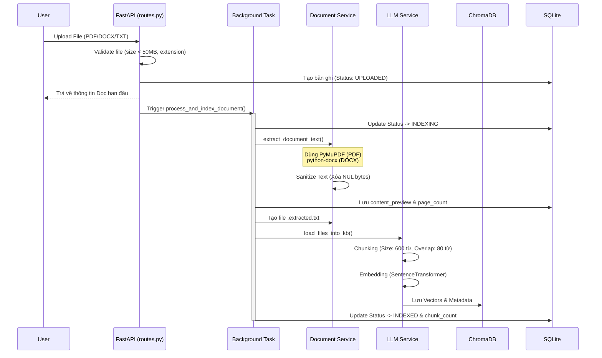
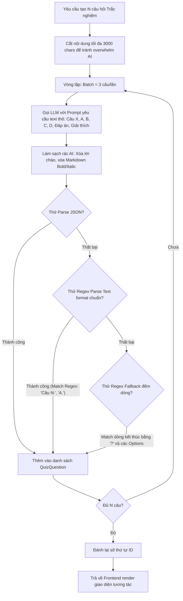

# Giải Thích Chi Tiết Luồng Nghiệp Vụ & Thuật Toán - Smart Document Reader

Tài liệu này cung cấp cái nhìn chuyên sâu và **chính xác nhất** về cách hệ thống hoạt động, bao gồm kiến trúc, sơ đồ luồng dữ liệu (Data Flow) và các thuật toán cốt lõi đã được hiện thực trong source code của `rag_project`.

---

## 1. Tổng Quan Kiến Trúc (Architecture Overview)

Hệ thống được thiết kế theo mô hình **Client-Server** với sự tách biệt rõ ràng giữa các tầng:

*   **Frontend (Streamlit):** Xử lý giao diện người dùng, quản lý state và gọi API. Gồm các tab: Quản Lý Tài Liệu, Đọc Tài Liệu, Tóm Tắt, Bài Tập, Hỏi & Đáp.
*   **Backend (FastAPI):** Expose các endpoints RESTful API (`/api/v1/...`). Quản lý routing và validate dữ liệu.
*   **Service Layer:** Chứa logic nghiệp vụ cốt lõi:
    *   `document_service.py`: Trích xuất văn bản, chunking, indexing.
    *   `rag_service.py`: Điều phối luồng Hỏi đáp, Tóm tắt, Sinh bài tập/Quiz.
    *   `llm_service.py`: Tương tác với Local LLM, nhúng (Embedding) và truy xuất Vector.
*   **Repository Layer:** Trừu tượng hóa thao tác CRUD với Database (`document_repo.py`, `history_repo.py`).
*   **Data Stores:**
    *   **SQLite (`rag.db`):** Lưu trữ metadata tài liệu, lịch sử hội thoại, cache tóm tắt.
    *   **ChromaDB:** Cơ sở dữ liệu Vector (Persistent) lưu trữ các chunk văn bản và vector embeddings.
    *   **File System:** Lưu file gốc (PDF/DOCX/TXT) và file text đã trích xuất (`.extracted.txt`).

---

## 2. Luồng Nghiệp Vụ Chi Tiết & Thuật Toán

### 2.1. Quản lý, Trích xuất và Indexing Tài Liệu

Luồng này xử lý việc đưa tài liệu thô vào hệ thống để AI có thể hiểu được. Việc trích xuất và indexing được chạy ngầm (background) để không block giao diện người dùng.



**Thuật toán Chunking:**
*   Hệ thống dùng thuật toán cửa sổ trượt (Sliding Window) cắt văn bản theo số từ.
*   `CHUNK_SIZE = 600`, `CHUNK_OVERLAP = 80`. Bước nhảy (Step) là 520 từ.
*   Việc có `Overlap` giúp bảo toàn ngữ nghĩa (context) giữa 2 chunk liền kề, tránh việc AI bị mất thông tin khi một đoạn văn quan trọng vô tình bị cắt làm đôi.

---

### 2.2. Thuật toán Hỏi & Đáp (Q&A) Cơ chế Kép (Full-Context & RAG)

Đây là tính năng thông minh cốt lõi của hệ thống, tự động phân tích độ lớn dữ liệu để chọn chiến lược tối ưu nhất.

```mermaid
flowchart TD
    Start[User đặt câu hỏi & chọn tài liệu] --> A{Có chọn tài liệu cụ thể?}
    A -- Có --> B[Lọc theo doc_ids được chọn]
    A -- Không --> C[Lấy tất cả tài liệu INDEXED]
    
    B --> D[Đọc toàn bộ nội dung file .extracted.txt]
    C --> D
    
    D --> E{Tổng độ dài ký tự <= FULL_CONTEXT_THRESHOLD?}
    
    E -- Thỏa mãn (Tài liệu nhỏ) --> F[Mode: FULL-CONTEXT]
    F --> F1[Đưa 100% nội dung vào Prompt]
    F1 --> F2[LLM sinh câu trả lời chính xác nhất]
    F2 --> End[Lưu Lịch sử. Trả kết quả + Nguồn: File đã chọn]
    
    E -- Vượt mức (Tài liệu lớn) --> G[Mode: RAG]
    G --> G1[Embedding vector cho câu hỏi]
    G1 --> G2[Vector Search trên ChromaDB lấy Top K chunks]
    G2 --> G3[Ghép K chunks thành Ngữ cảnh (Context)]
    G3 --> G4[Đưa Context vào Prompt, LLM sinh câu trả lời]
    G4 --> End[Lưu Lịch sử. Trả kết quả + Nguồn: Các Chunks khớp]
```

**Phân tích chiến lược:**
1.  **Full-Context Mode:** Khi lượng từ đủ nhỏ để nhét vừa Context Window của LLM, hệ thống gửi toàn bộ văn bản. Đảm bảo độ chính xác tuyệt đối 100%, tránh hiện tượng RAG bỏ sót thông tin do thuật toán tìm kiếm vector (similarity search) bị trượt.
2.  **RAG Mode (Retrieval-Augmented Generation):** Khi tài liệu quá dài. Hệ thống tự động giới hạn ngữ cảnh bằng Semantic Search. Tính toán khoảng cách vector (Similarity Score) để lấy ra những đoạn trích xuất liên quan nhất, giúp AI không bị quá tải.

---

### 2.3. Tóm tắt Tài Liệu Lớn (Large Document Summarization)

Mô hình ngôn ngữ có giới hạn đầu vào (Context Window). Để tóm tắt một file PDF hàng chục trang, hệ thống sử dụng kỹ thuật **Map-Reduce** tùy chỉnh:

1.  **Kiểm tra & Nhánh rẽ:** Đọc toàn bộ file. Nếu số lượng ký tự nhỏ hơn giới hạn an toàn (`LLM_MAX_CONTENT_CHARS`), gọi LLM tóm tắt trực tiếp (One-shot prompt).
2.  **Chia nhỏ (Map):** Nếu văn bản quá lớn, hệ thống cắt văn bản thành các phân đoạn (`segment_size = LLM_MAX_CONTENT_CHARS // 2`).
3.  **Tóm tắt từng phần:** Lặp qua từng phân đoạn, gọi API LLM để tóm tắt cục bộ từng phần nhỏ.
4.  **Tổng hợp (Reduce):** Nối tất cả các tóm tắt cục bộ lại với nhau. Gọi LLM một lần cuối cùng với Prompt chỉ đạo: *"Dưới đây là tóm tắt từng phần... Hãy tổng hợp thành 1 bản hoàn chỉnh, mạch lạc."*
5.  **Caching:** Lưu kết quả vào cột `summary` của SQLite. Lần sau người dùng yêu cầu, hệ thống trả về ngay lập tức (thời gian phản hồi < 0.1s).

---

### 2.4. Thuật toán Sinh Trắc Nghiệm Tương Tác (Quiz Generation)

Do sử dụng Local LLM (thường là các mô hình nhỏ như Qwen 2.5 7B, Gemma, Llama 3 8B), việc yêu cầu AI sinh ra một cấu trúc JSON phức tạp cho hàng chục câu hỏi cùng lúc là bất khả thi, dễ bị lỗi format (JSON Decode Error). 

Thuật toán sinh Quiz sử dụng cơ chế **Micro-Batching** và **Multi-layer Fallback Parsing**:



**Tính bền bỉ (Robustness):** 
Dù LLM có "ảo giác" (hallucinate) hay trả về định dạng lộn xộn, hệ thống Regular Expression (Regex) nhiều tầng của Backend vẫn có khả năng bóc tách chính xác: nội dung câu hỏi, 4 đáp án A-B-C-D, đáp án đúng và lời giải thích. Đảm bảo UI luôn hiển thị đẹp mắt.

---

## 3. Khởi Động & Quản Lý Trạng Thái (Lifecycle)

-   **Singleton LLMService:** Service quản lý kết nối LLM được khởi tạo 1 lần duy nhất để tiết kiệm RAM.
-   **Tự động giới hạn Context Window:** Khi FastAPI khởi động (trong `lifespan` event), hệ thống gọi API `/v1/models` của LM Studio/Ollama để detect kích thước Context Window của mô hình hiện tại (ví dụ: 8192 tokens). Từ đó, tự động tính toán `max_content_chars` và `max_output_tokens` giới hạn an toàn.
-   **Reload Knowledge Base (KB):** Quét database SQLite lấy các tài liệu có trạng thái `INDEXED`, tìm các file `.extracted.txt` tương ứng và nạp lại vào bộ nhớ của `LLMService`. Giúp hệ thống không bị mất khả năng tìm kiếm vector khi restart server FastAPI.
-   **Xử lý lỗi (Error Handling):** Hệ thống chặn tải file quá 50MB, tự động sanitize ký tự Null (`\x00`) gây crash ChromaDB, và timeout an toàn (600s) cho các request gọi AI tốn thời gian.
