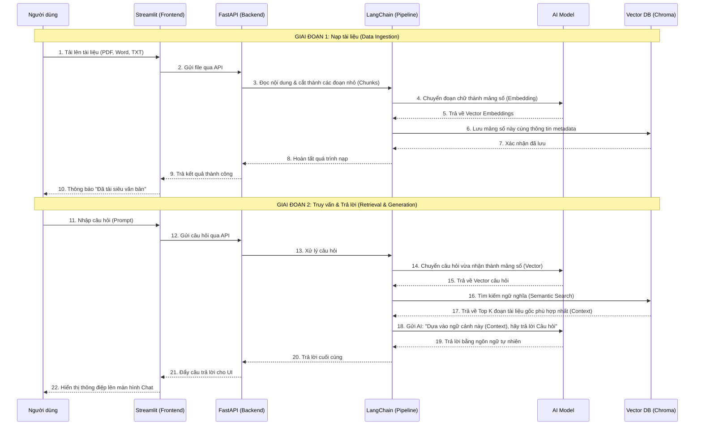

# Quy trình hoạt động của hệ thống RAG

Hệ thống RAG (Retrieval-Augmented Generation) của bạn bao gồm 2 giai đoạn chính: **Nạp dữ liệu (Ingestion)** và **Hỏi đáp (Retrieval & Generation)**.

## Sơ đồ tổng quan

## Giải thích chi tiết các bước

### Giai đoạn 1: Nạp tài liệu vào bộ nhớ AI (Data Ingestion)

Khi người dùng upload một cuốn sách hoặc tài liệu lên, hệ thống sẽ thực hiện theo trình tự sau:
1. **Trích xuất & Cắt nhỏ (Chunking):** Tài liệu sẽ được LangChain trích xuất văn bản chữ và chia nhỏ (chunk) thành hàng nghìn đoạn ngắn khoảng 500-1000 từ để đảm bảo giới hạn phân tích của AI.
2. **Vector hóa (Embedding):** Mỗi đoạn chữ sẽ được đi qua mô hình nhúng (Embedding Model) để chuyển đổi sang các dãy số tọa độ liên tục. Máy tính tính toán khoảng cách dãy số sẽ nhanh hơn chữ viết.
3. **Lưu trữ (ChromaDB):** Toàn bộ các dòng tọa độ dãy số đó sẽ được cất vào trong một bộ nhớ được tối ưu cho RAG gọi là Vector Database (trong trường hợp dự án này là ChromaDB). Đi kèm với nó là các Metadata như (tên tác giả, thông tin bổ sung).

### Giai đoạn 2: Lấy thông tin và trả lời người dùng (Retrieval & Generation)

Khi người dùng đặt câu hỏi trên giao diện Streamlit:
1. **Tìm kiếm (Semantic Search):** Hệ thống lấy câu hỏi vừa nhập và tiếp tục biến nó thành một dải số Vector. Sau đó nó vào ChromaDB để rà soát xem **mảng văn bản nào gần với chỉ số của câu hỏi nhất**. Nó sẽ nhặt ra khoảng 3-5 đoạn văn bản liên quan nhất (Top K).
2. **Sinh câu trả lời (Generation):** Hệ thống gom 3-5 đoạn đó cộng với câu hỏi gốc đặt ra, nhét chung vào một cái hộp tên là Prompt. Prompt này được gửi đến AI LLM (như OpenAI ChatGPT hoặc Gemini) yêu cầu phản hồi câu trả lời sử dụng thông tin và sự thật từ những "Ngữ cảnh" vừa được cung cấp từ ChromaDB. Việc này đảm bảo AI không sinh ra câu trả lời ảo (Hallucination).
3. Kết quả phản hồi (Chatbot) sẽ được đẩy xuống trở lại giao diện API (FastAPI) vào Frontend (Streamlit) để phục vụ cho người dùng đọc và tìm kiếm.
